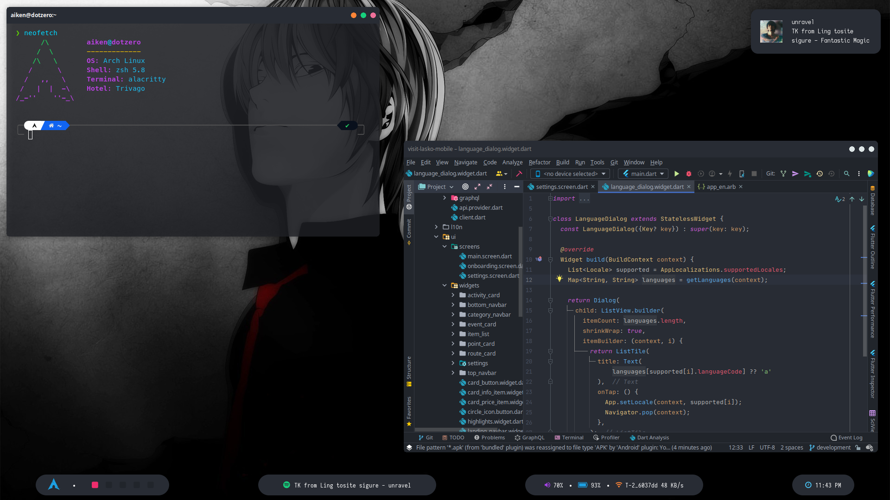

# Yagami Dotfiles

## System info

- OS > Arch Linux
- WM > Openbox

## Programs

- Polybar > bottom bar
- Alacritty > terminal
- Dunst > notifications
- Neofetch > info about system
- IntelliJ IDEA Ultimate > IDE

### Credits

Special thanks to [mihacho](https://github.com/micahco) for the [spotify-now](https://github.com/micahco/spotify-now) script used for displaying Spotify info in my Polybar
